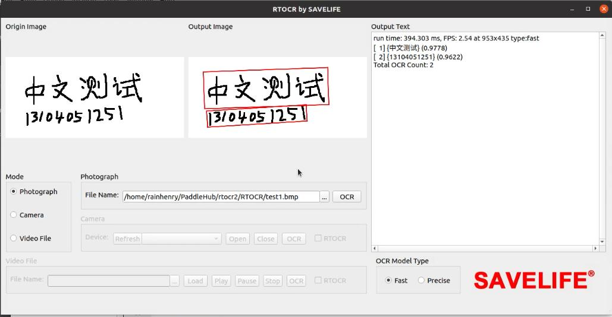
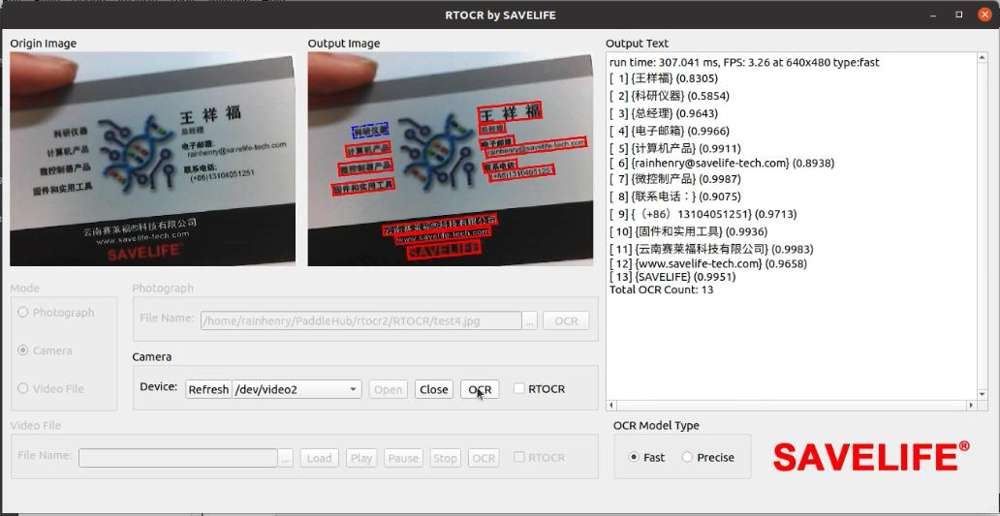
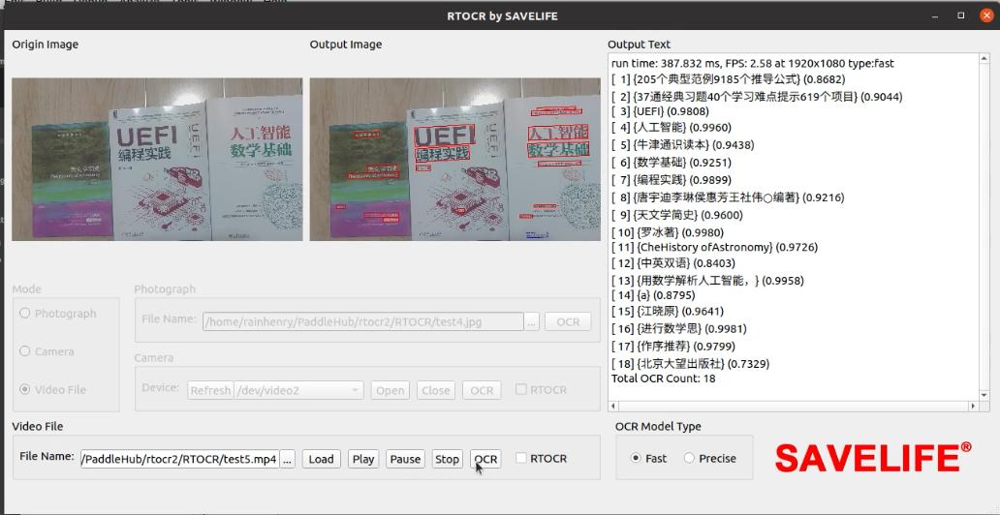
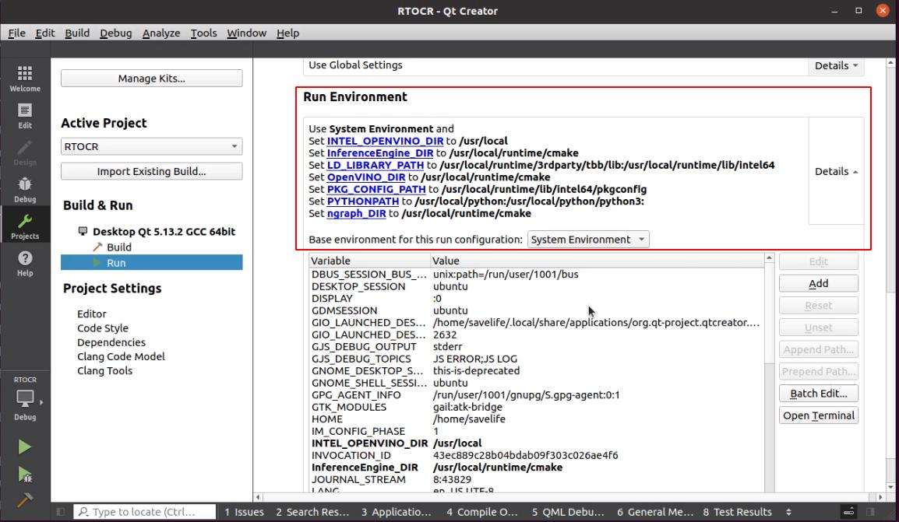
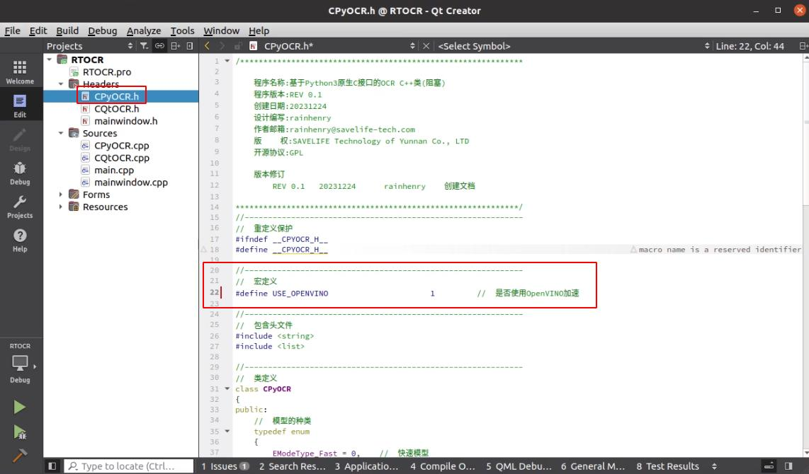
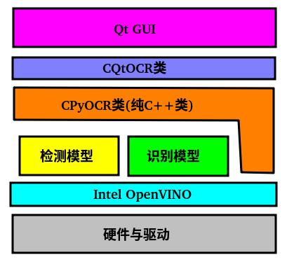

# RTOCR
## 1、运行效果

### 1.1、静态图片的OCR



### 1.2、摄像头视频的实时OCR



### 1.3、视频文件的逐帧OCR



## 2、编译环境搭建

### 2.1、操作系统与硬件要求

操作系统：Ubuntu 20

硬件平台：Intel酷睿或者志强，内存16GB以上

### 2.2、软件依赖安装

基本的软件依赖

```shell
sudo -E apt-get install gcc g++ make git vim build-essential
```

安装python3

```shell
sudo -E apt-get install python python3 python3-pip
```

摄像头与视频

```shell
sudo -E apt-get install gstreamer1.0-libav
```

OpenGL

```shell
sudo -E apt-get install libgles2-mesa-dev libglfw3-dev
```

Python包依赖

```shell
sudo -E pip3 install --upgrade pip
sudo -E pip3 install --upgrade shapely 
sudo -E pip3 install --upgrade pyclipper
sudo -E pip3 install --upgrade paddlepaddle
sudo -E pip3 install --upgrade paddlehub

## 如果在这一步遇到Cannot uninstall 'blinker'开头的报错,请执行下面的命令
# sudo -H pip install --ignore-installed -U blinker

##  然后解决版本依赖
sudo -E pip3 install --upgrade "protobuf==3.20.0"
sudo -E pip3 install --upgrade "numpy==1.20.3"
```

安装下载模型

```shell
hub install chinese_ocr_db_crnn_server            ##  服务版(精确的)
hub install chinese_ocr_db_crnn_mobile            ##  移动版(快速的)
```

### 2.3、库下载与环境验证

上述相关安装完成后，需要先运行验证脚本，因为首次执行需要下载一些文件到本地用户目录中

```shell
./ocr_test.sh
```

如果一切正常，会有如下log输出

```
[{'save_path': '', 'data': [{'text': '中文测试', 'confidence': 0.9982107877731323, 'text_box_position': [[72, 79], [750, 49], [758, 254], [79, 284]]}, {'text': '13104051251', 'confidence': 0.9960362911224365, 'text_box_position': [[89, 284], [610, 253], [615, 348], [94, 379]]}]}]
[{'save_path': '', 'data': [{'text': '中文测试', 'confidence': 0.9773508906364441, 'text_box_position': [[80, 80], [745, 57], [751, 256], [87, 278]]}, {'text': '13104051251', 'confidence': 0.9415748119354248, 'text_box_position': [[94, 291], [610, 260], [614, 347], [98, 378]]}]}]

```


### 2.4、Qt的安装和编译

我这里使用的是qt5.13.2的linux安装包，可以从下面的地址下载

https://download.qt.io/new_archive/qt/5.13/5.13.2/qt-opensource-linux-x64-5.13.2.run

下载完成后，给该文件增加可执行权限

```shell
chmod +x qt-opensource-linux-x64-5.13.2.run
```

然后按照界面的提示一步一步安装即可，详细安装过程可以参考下面的演示视频

然后编译的话只要用Qt Creator打开我们源码中的RTOCR.pro工程即可

## 3、使用OpenVINO加速

### 3.1、OpenVINO的编译和安装

首先需要下载OpenVINO源码

```shell
git clone https://github.com/openvinotoolkit/openvino.git
cd openvino
git submodule update --init --recursive
```

然后安装依赖

```shell
sudo -E apt-get install cmake
chmod +x install_build_dependencies.sh
sudo -E ./install_build_dependencies.sh
sudo -E pip3 install "cython>=3.0.2"
```

然后创建build目录

```shell
mkdir build
cd build
```

然后配置cmake

```shell
cmake -DCMAKE_BUILD_TYPE=Release -DENABLE_PYTHON=ON ..
```

然后编译和安装

```shell
make -j20
sudo make install
```

### 3.2、验证OpenVINO环境

本代码中自带一个验证脚本，只要执行

```shell
source /usr/local/setupvars.sh
./ocr_openvino_test.py
```

如果一切顺利，会有如下log输出

```
[['中文测试', 0.9796985, 0, 79, 798, 47, 839, 258, 35, 290], ['13104051251', 0.90090334, 70, 285, 625, 253, 653, 354, 98, 386]]
```


### 3.3、Qt运行时的环境变量导入

正常运行基于OpenVINO的应用之前，都要初始化OpenVINO的环境，官方的做法是

```shell
source /usr/local/setupvars.sh
```

经过我的分析，它最终影响的是系统环境变量的结果，主要有作用的是

```shell
export PKG_CONFIG_PATH=/usr/local/runtime/lib/intel64/pkgconfig
export InferenceEngine_DIR=/usr/local/runtime/cmake
export OpenVINO_DIR=/usr/local/runtime/cmake
export INTEL_OPENVINO_DIR=/usr/local
export PYTHONPATH=/usr/local/python:/usr/local/python/python3:
export LD_LIBRARY_PATH=/usr/local/runtime/lib/intel64
export ngraph_DIR=/usr/local/runtime/cmake
```

所以需要在Qt中也包含这些变量，修改完如下图



然后直接单击运行按钮就可以正常使用OpenVINO了

### 3.3、源码中开启OpenVINO支持



本代码中，默认是不打开OpenVINO的支持的，如果想要添加OpenVINO的支持，请打开源码的CPyOCR.h文件，将上图的USE_OPENVINO的宏定义值修改为1，即可打开OpenVINO的支持

## 4、方案与原理

### 4.1、方案思路、实现方法与亮点

本代码使用了PaddleHub的开源OCR模型，可以实现对静态图片、摄像机 和 本地视频文件进行实时的OCR处理。调用OCR模型部分采用了Python编写，这样可以最大限度的兼容原生模型的API和功能。而数据处理则采用C++编写，方便用于各种应用场景集成。用户界面采用Qt5框架编写，拥有非常完整的软件生态，便于移植。该方案的一个亮点是OCR的全过程数据处理完全由C++类封装，这样可以方便移植和集成到各种嵌入式linux系统中，使得人工智能应用的小型化和本地化变得更方便。此外，该方案另一个亮点在于，使用了Intel OpenVINO的支持，借助OpenVINO强大的生态系统，几乎可以在任何设备上轻松实现AI加速的部署。

### 4.2、使用的模型

https://www.paddlepaddle.org.cn/hubdetail?name=chinese_ocr_db_crnn_server&en_category=TextRecognition

 https://www.paddlepaddle.org.cn/hubdetail?name=chinese_ocr_db_crnn_mobile&en_category=TextRecognition

https://paddleocr.bj.bcebos.com/PP-OCRv3/chinese/ch_PP-OCRv3_det_infer.tar
https://paddleocr.bj.bcebos.com/PP-OCRv3/chinese/ch_PP-OCRv3_rec_infer.tar

### 4.3、程序框架与参考源码



软件的最底层是Intel的OpenVINO，当打开OpenVINO功能后，则通过OpenVINO的Core加载“检测模型”和“识别模型”。其中“检测模型”是从原图中识别出文字的区域，然后"识别模型"是根据这些区域进行识别出具体的文字信息。为了方便移植，我构造了一个CPyOCR的纯C++的类，将这些都封装了起来。然后为了方便提供给上层的Qt的界面使用，中间层又使用了一个CQtOCR的类，用于将上下层衔接起来。然后最上层就是Qt的GUI界面的代码。

OpenVINO的Python使用参考 https://github.com/zhuo-yoyowz/openvino_notebooks

## 6、演示视频

【RTOCR实时光学字符识别 开源项目介绍-哔哩哔哩】 https://b23.tv/u8xpsCq

【RTOCR基于OpenVNIO的优化加速部署-哔哩哔哩】  https://b23.tv/JhMNZEy

## 7、联系方式

邮箱：rainhenry@savelife-tech.com

## 8、许可证

本代码采用GPLv3许可证 https://www.gnu.org/licenses/gpl-3.0.en.html
